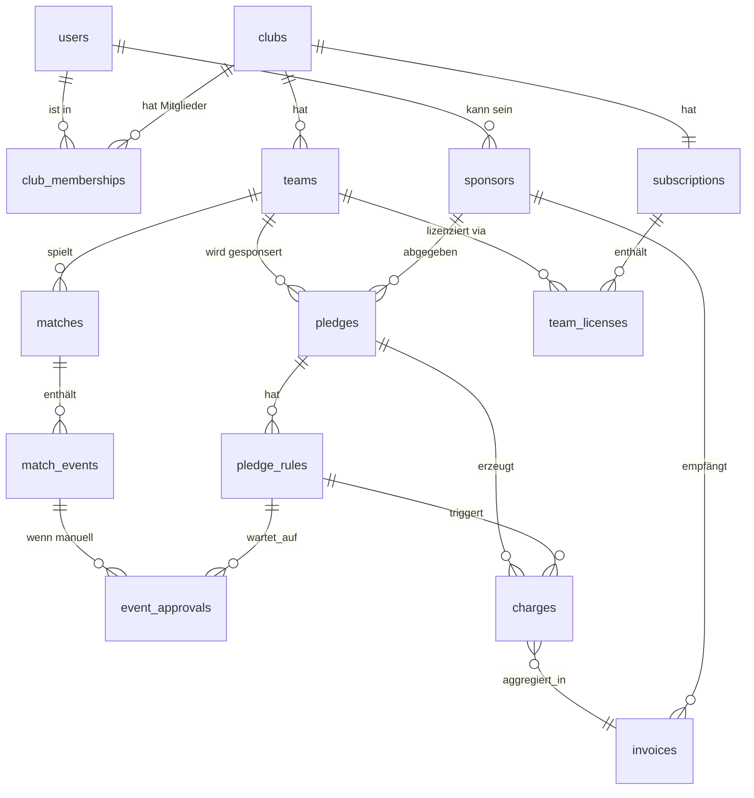

# KickPact v1 — Design-Spec

**Datum:** 2026-05-19
**Autor:** Johannes Schartl (mit Claude Code)
**Status:** Draft → Review pending

## 1. Zweck

KickPact ist eine Plattform, über die Amateur-Fußballvereine performance-basierte Sponsoring-Vereinbarungen mit Sponsoren (Familie, Freunde, lokalen Unternehmen) abschließen. Sponsoren versprechen Geldbeträge an bestimmte Spielereignisse — z.B. *5€ pro Tor*, *2€ pro Zu-Null-Sieg*, *10€ pro Comeback*. Spielergebnisse und Events werden automatisch von [fussball.de](https://www.fussball.de) gescraped, Spezial-Events (Kopfballtor, Hackentor, etc.) trägt der Verein manuell nach und der Sponsor bestätigt. Am Monatsende erzeugt KickPact eine Rechnung des Vereins an den Sponsor (PDF). Verein zieht das Geld direkt ein.

**v1 ist Web-only**, Architektur ist Mobile-ready (Backend = saubere JSON-API), Mobile-App (Expo) kommt in v2.

**v1 ist Tracking-only**, kein echtes Geld fließt über KickPact. Verein und Sponsor regeln Zahlung off-platform (auf Basis der KickPact-PDF-Rechnung). Stripe Connect Auto-Charge ist v2.

## 2. Out-of-Scope für v1

- Native Mobile-App (iOS/Android) — kommt in v2 mit Expo, teilt API
- Stripe Connect / Auto-Charge / Treuhand — v2
- Live-Match-Push-Notifications während Spielen — v2 (zusammen mit Mobile)
- Bildupload-/Video-Beweise für Manual Events — v2
- Vereins-Hierarchie (Bezirksverband → Verein → Mannschaft)
- Multi-Mannschaft pro Pledge (1 Pledge = 1 Mannschaft im MVP)
- Cross-Sponsor-Stats ("Mannschaft Y hat insgesamt 1.234€ gesammelt") als public-facing Leaderboard
- A/B-Testing oder Pledge-Templates-Marketplace

## 3. Stack

| Layer | Wahl | Begründung |
|---|---|---|
| Web Frontend + API | **Next.js 15** App Router | Deckt sich mit `Johannes221/kmu-web-starter` |
| DB | **Postgres** via **Neon** | Relationale Joins (Sponsor↔Pledge↔Match↔Charge) |
| ORM | **Drizzle** | Typsicher, einfache Migrations |
| Auth | **Better Auth** | Magic Link (Email) + Google OAuth |
| UI | **Tailwind v3.4 + shadcn/ui + motion + Lenis** | KMU-Starter-Stack |
| Job-Runner | **Inngest** | Crawler-Cron, Retries, Observability gemanagt |
| Crawler | **Playwright** (in Inngest-Job) | Bestehender [crawler.js](../../crawler.js) wird portiert |
| PDF | **`@react-pdf/renderer`** | Typsicher, React-native |
| Mail | **Resend** | 3000 Mails/Mon kostenlos, gute DX |
| Payments | **Stripe** (Subscription + Items) | Abo pro Verein, Items pro Mannschaft |
| Hosting | **Vercel** | Standard für Next.js |

## 4. Architektur

```
┌─────────────────────────────────────────────────────────────────────┐
│                       Next.js App (Vercel)                          │
│  ┌──────────────────────────┐    ┌──────────────────────────┐      │
│  │ Web UI (App Router)       │    │ API Routes (REST)         │      │
│  │  • Marketing/Pricing      │    │  • /api/auth/[...all]     │      │
│  │  • /verein/[slug]/* (Admin)│◄──►│  • /api/clubs, /teams, …  │      │
│  │  • /sponsor/* (Sponsor)   │    │  • /api/pledges, /charges │      │
│  │  • /onboarding/*          │    │  • /api/stripe/webhook    │      │
│  └──────────────────────────┘    │  • /api/inngest           │      │
│                                   └──────────┬───────────────┘      │
└──────────────────────────────────────────────┼──────────────────────┘
                                               │
                ┌──────────────────────────────┼──────────────────────┐
                ▼                              ▼                      ▼
       ┌─────────────────┐         ┌─────────────────────┐   ┌──────────────┐
       │ Postgres (Neon) │         │  Inngest             │   │ Stripe       │
       │  Drizzle Schema │         │  Jobs:               │   │  • Abo       │
       │                 │         │  • crawl-matches     │   │  • Webhooks  │
       └─────────────────┘         │  • evaluate-match    │   └──────────────┘
                                   │  • generate-invoices │
                                   │  • reminder-job      │   ┌──────────────┐
                                   │  • playwright in     │   │ Resend (Mail)│
                                   │    crawl-matches     │   └──────────────┘
                                   └──────────────────────┘
```

### 4.1 Komponenten-Verantwortlichkeit

- **Next.js App:** UI (Server Components + Client Components), Auth (Better Auth), REST-API für Frontend, Stripe-Webhook, Inngest-Endpoint
- **Postgres/Drizzle:** Source of Truth für alle Geschäftsdaten
- **Inngest:** Job-Runner mit Retries, Observability, Cron-Schedules. Hier laufen alle Background-Jobs inkl. Playwright-Scraper
- **Stripe:** KickPact-Abo (eine Subscription pro Verein, Items pro Mannschaft) + (v2) Stripe Connect
- **Resend:** Transactional Emails (Magic Link, Approval-Reminder, Invoice-Versand, Trial-Reminder)

### 4.2 Daten-Fluss (Happy Path)

1. Verein-Admin registriert → Onboarding-Wizard: Fußball.de-Suche → Mannschaft pickt → Stammdaten → Sponsor-Einladungslink. 30d Trial startet für die erste lizenzierte Mannschaft. Stripe-Customer wird angelegt.
2. Verein teilt Einladungslink. Sponsor klickt → Magic-Link-Signup → wählt `familie` oder `business` (Business → Adresse, USt-ID).
3. Sponsor konfiguriert einen Pledge: Trigger-Auswahl → Beträge → optional Caps → Laufzeit (default Saison-Ende). Status `active`.
4. **Inngest-Cron** `crawl-matches` läuft alle 6h: Pro aktive Mannschaft via Playwright `getSpiele` + `getSpielDetails`. Neue `Match`-Rows idempotent über `fussballde_spiel_id` UNIQUE.
5. Pro neuem Match feuert `evaluate-match`: lädt alle `active` Pledges für die Mannschaft, evaluiert jede `pledge_rule` gegen die Match-Events, erzeugt `Charges` (status `confirmed` für auto-getriggerte). Respektiert Caps.
6. Verein-Admin meldet ggf. Spezial-Events via Match-Detail-Page (Spieler, Minute, Subtype). `match_event` mit `source='manual'` → `evaluate-match-event` Job erzeugt `Charges` (status `pending_approval`) + `event_approvals` (status `pending`).
7. Sponsor sieht `/sponsor/inbox`: bestätigen oder bestreiten → `Charge` geht auf `confirmed` oder `cancelled`.
8. **Inngest-Cron** `generate-invoices` läuft am 1. eines Monats: aggregiert confirmed Charges pro (Sponsor, Verein) → PDF-Render → Mail an Sponsor + Verein → Charges auf `invoiced`.
9. Verein markiert Invoice manuell als bezahlt (echtes Geld off-platform). Sponsor-Dashboard zeigt Saldo.

## 5. Datenmodell



### 5.1 Schlüssel-Tabellen

| Tabelle | Felder (highlights) |
|---|---|
| `users` | `id`, `email` UNIQUE, `name`, `email_verified`, `created_at` |
| `clubs` | `id`, `slug` UNIQUE, `name`, `ort`, `fussballde_verein_id` UNIQUE, `tax_id`, `is_small_business` (§19 UStG), `address_json`, `iban`, `logo_url` |
| `teams` | `id`, `club_id` FK, `name`, `saison` (z.B. `2526`), `fussballde_team_id`, `fussballde_slug`, `is_active` |
| `club_memberships` | `user_id` FK, `club_id` FK, `role` (`admin`\|`trainer`\|`viewer`), PRIMARY KEY (user_id, club_id) |
| `sponsors` | `id`, `user_id` FK, `display_name`, `type` (`familie`\|`business`), `business_name`, `business_address_json`, `business_tax_id` (nullable) |
| `pledges` | `id`, `sponsor_id` FK, `team_id` FK, `status` (`active`\|`paused`\|`ended`), `starts_at`, `ends_at`, `monthly_cap_cents` (nullable) |
| `pledge_rules` | `id`, `pledge_id` FK, `trigger_type` (enum, siehe 5.3), `trigger_params_json`, `amount_cents`, `per_match_cap_cents` (nullable), `requires_approval` (bool) |
| `matches` | `id`, `team_id` FK, `fussballde_spiel_id` UNIQUE, `datum`, `heim_name`, `gast_name`, `ergebnis_heim`, `ergebnis_gast`, `halbzeit_heim`, `halbzeit_gast`, `status`, `crawled_at` |
| `match_events` | `id`, `match_id` FK, `minute`, `type` (`tor`\|`auswechslung`\|`spezial`), `subtype` (nullable, z.B. `kopfball`), `side` (`heim`\|`gast`), `player_name`, `player_id` FK→`players.id` (nullable), `source` (`scraped`\|`manual`), `reported_by_user_id` FK→`users.id` (nullable) |
| `event_approvals` | `id`, `match_event_id` FK, `pledge_rule_id` FK, `status` (`pending`\|`confirmed`\|`disputed`\|`expired`), `responded_at`, `expires_at` (= Saison-Ende des Teams), `reminder_count`, `last_reminded_at` |
| `charges` | `id`, `pledge_id` FK, `pledge_rule_id` FK, `match_id` FK, `match_event_id` FK (nullable), `amount_cents`, `status` (`pending_approval`\|`confirmed`\|`invoiced`\|`cancelled`), `created_at`, `confirmed_at`, UNIQUE (`pledge_rule_id`, `match_event_id`), UNIQUE (`pledge_rule_id`, `match_id`, `trigger_type`) für match-level triggers |
| `invoices` | `id`, `sponsor_id` FK, `club_id` FK, `period` (YYYY-MM), `total_cents`, `pdf_url`, `status` (`draft`\|`sent`\|`paid`), `sent_at`, `paid_marked_at`, `paid_marked_by` |
| `invoice_items` | `id`, `invoice_id` FK, `charge_id` FK, `description`, `amount_cents` |
| `subscriptions` | `club_id` FK PK, `stripe_customer_id`, `stripe_subscription_id`, `status`, `trial_ends_at` |
| `team_licenses` | `id`, `subscription_id` FK, `team_id` FK, `plan` (`basic`\|`pro`), `stripe_subscription_item_id`, `status` (`trialing`\|`active`\|`past_due`\|`cancelled`\|`read_only`), `activated_at` |
| `players` | `id`, `team_id` FK, `fussballde_player_id`, `name` |

### 5.2 Constraints + Indizes

- `matches.fussballde_spiel_id` UNIQUE → Crawler-Idempotenz
- `charges (pledge_rule_id, match_event_id)` UNIQUE → keine Doppel-Verbuchung manueller Events
- `charges (pledge_rule_id, match_id, trigger_type)` UNIQUE — verhindert Doppel-Auswertung match-level Trigger (sieg, clean_sheet, ...)
- Indizes auf `matches (team_id, datum DESC)`, `charges (pledge_id, status)`, `event_approvals (pledge_rule_id, status, expires_at)`

### 5.3 Trigger-Type-Katalog

**Auto-Trigger (Scraper liefert direkt aus Match-Daten):**

| `trigger_type` | Params | Beschreibung |
|---|---|---|
| `goal_total` | — | Betrag × Anzahl Tore der Mannschaft im Spiel |
| `goal_by_player` | `player_id` oder `player_name` | Betrag × Tore eines bestimmten Spielers |
| `win` | — | 1× Betrag bei Sieg |
| `loss` | — | 1× Betrag bei Niederlage (selten genutzt, aber möglich) |
| `draw` | — | 1× Betrag bei Unentschieden |
| `clean_sheet` | — | 1× Betrag bei Sieg ohne Gegentor |
| `comeback_win` | — | 1× Betrag bei Sieg, wenn zur Halbzeit hinten |
| `hattrick` | — | 1× Betrag wenn ein Spieler ≥3 Tore |
| `goal_diff_min` | `min_diff` (z.B. 3) | 1× Betrag wenn Tordifferenz ≥ min_diff |
| `goals_scored_min` | `min_goals` (z.B. 5) | 1× Betrag wenn eigene Tore ≥ min_goals |

**Manuelle Trigger (Verein meldet, Sponsor bestätigt):**

| `trigger_type` | Subtype-Beispiele | Beschreibung |
|---|---|---|
| `special_goal` | `kopfball`, `hackentor`, `volley`, `fernschuss`, `elfmeter`, `freistoss` | Tor mit besonderer Charakteristik |
| `yellow_card` | — | Pro gelbe Karte |
| `red_card` | — | Pro rote Karte (Sponsor will Disziplin fördern) |
| `assist` | — | Pro Vorlage eines bestimmten Spielers |
| `man_of_match` | — | 1× pro Spiel wenn Spieler X "Spieler des Spiels" |
| `custom` | beliebig | Verein nennt es selber (z.B. "Bizeps-Tor von Schmidt") |

**Saison-Wetten (1× pro Saison, evaluiert am Saison-Ende):**

Saison-Wetten sind Pledges, die nicht pro Spiel feuern, sondern erst wenn die
Saison gewertet wurde. Charge entsteht 1× pro `(pledge_rule, saison)` mit Status
`pending` bis zur Auswertung, dann `confirmed` (Ziel erreicht) oder `cancelled`
(verfehlt).

| `trigger_type` | Params | Beschreibung |
|---|---|---|
| `season_promotion` | — | Aufstieg (Platz 1 oder 2, Liga-abhängig) |
| `season_no_relegation` | — | Klassenerhalt |
| `season_table_position` | `min_pos`, `max_pos` (z.B. 1–5, 5–9) | End-Tabellenplatz innerhalb Range |
| `season_champion` | — | Tabellenführer am Saisons-Ende |
| `season_cup_round` | `min_round` (z.B. "halbfinale") | Verbands-/Kreispokal-Runde mindestens erreicht |
| `season_custom` | `goal_text` | Verein meldet manuell + Sponsor bestätigt (z.B. "20 Tore mehr als letzte Saison") |

Auto-Evaluation: Inngest-Job `evaluate-season` läuft 24h nach offiziellem
Saisons-Ende (Fußball.de-Saisonkalender), liest End-Tabelle, erzeugt Charges.
Manuelle Saison-Wetten landen wie `special_goal` in der Approval-Inbox.

### 5.4 Approval-Lifecycle

- Manual Event wird gemeldet → `event_approval.status = pending`, `expires_at = saison_ende(team)`, `Charge.status = pending_approval`
- Reminder-Job (täglicher Inngest-Cron):
  - Nach 7d, 14d, 30d: Reminder-Mail + In-App-Banner-Counter
  - Danach: monatlich erinnert
- Sponsor bestätigt → `approval.status = confirmed`, `Charge.status = confirmed`
- Sponsor bestreitet (mit optionalem Grund) → `approval.status = disputed`, `Charge.status = cancelled`
- Saison-Ende (`expires_at` erreicht): Cleanup-Job setzt `approval.status = expired`, `Charge.status = cancelled`. Mail an Verein + Sponsor: "X pending Approvals sind mit Saison-Ende verfallen."

## 6. Kern-Flows

### 6.1 Vereins-Onboarding

```
Landing → "Verein anlegen"
  → Magic-Link-Signup
  → Wizard 1: Fußball.de-Suche (Crawler-Endpoint searchVereine)
  → Wizard 2: Mannschaft(en) wählen + Plan (Basic 9€ oder Pro 19€)
  → Wizard 3: Stammdaten (Adresse, USt-ID ODER §19 KU-Flag, IBAN, Logo)
  → Wizard 4: Sponsor-Einladungslink generiert
  → 30d Trial für erste Mannschaft, Stripe-Customer angelegt
```

### 6.2 Sponsor-Onboarding

```
/einladung/<token>
  → "Verein X lädt dich ein, Mannschaft Y zu unterstützen"
  → Magic-Link-Signup
  → Sponsor-Typ wählen (familie / business → zusätzliche Felder)
  → Pledge-Setup-Wizard (siehe 6.3)
```

**Eltern-als-Sponsor-Manager (Junioren-Use-Case):**

Bei Jugend-Mannschaften haben die eigentlichen "Spender" (Oma, Onkel, Patentanten)
oft keine eigene Mail-Adresse oder Lust, die App einzurichten. Lösung:
ein Elternteil legt **ein** Sponsor-Konto an, der `sponsors`-Datensatz erhält
ein optionales Array `pledge_proxies`: `[{name, contribution_amount_cents, note}]`.
Auf der Rechnung erscheint dann eine Aufgliederung "davon: Oma 30€, Onkel Klaus 50€",
und der Elternteil verteilt das eingenommene Geld privat.

DB-Erweiterung:
- `sponsors.pledge_proxies_json` (nullable JSONB) — nur befüllt wenn dieser
  Sponsor als Manager für mehrere Personen agiert. Optional. Hat keine
  Auswirkung auf den Trigger-/Charge-Mechanismus, ist reines Rechnungs-Detail.

### 6.3 Pledge-Setup (Sponsor)

```
Wizard 1: Trigger-Auswahl (Multi-Select aus Katalog, mit Beispielen + Voreinstellungen)
Wizard 2: Pro Trigger: Betrag + optionaler per-match Cap
Wizard 3: Monats-Cap (optional, Hinweis-Banner falls leer)
Wizard 4: Laufzeit (default: bis Saison-Ende des Teams)
Review-Step: "Worst-Case-Berechnung" — bei dieser Konfiguration könntest du im Saisonschnitt 180–400€ zahlen.
→ Speichern, status=active
```

### 6.4 Spiel-Auswertung (automatisch)

```
Inngest Cron alle 6h: crawl-matches
  Pro aktivem Team:
    - getSpiele(team_id, saison): neue Matches finden
    - getSpielDetails(spiel_id): Events + Halbzeit + Trigger-Daten
    - Match + MatchEvents idempotent inserten
Pro neuem Match → evaluate-match Job:
  Lädt active Pledges für Team
  Pro Pledge → pro Pledge-Rule:
    - matchet Trigger-Type? Auto?
    - berechnet Charge-Amount (Anzahl × Betrag, gecapped per_match + monthly)
    - inserted Charge (status=confirmed)
    - Notification: in-app sofort sichtbar; Mail-Versand gebündelt als täglicher Digest (vermeidet Mail-Spam bei Spieltagen mit vielen Triggern)
```

### 6.5 Manuelles Event (Verein-Admin)

```
/verein/[slug]/spiel/[id] → "Spezial-Event hinzufügen" Modal
  Minute, Type (special_goal | yellow_card | …), Subtype, Spieler, Side
→ match_event (source=manual, reported_by_user_id)
→ evaluate-match-event Job:
  Für jede matchende Pledge-Rule:
    - Charge (status=pending_approval)
    - event_approval (status=pending, expires_at=saison_ende)
    - notifiziert Sponsor (in-app + sofortige Mail)
```

### 6.6 Approval (Sponsor)

```
/sponsor/inbox → Liste pending events
Pro Item: [Bestätigen] / [Bestreiten + optional Grund]
  Bestätigen → charge.status=confirmed, approval.status=confirmed
  Bestreiten → charge.status=cancelled, approval.status=disputed
Verein-Admin sieht Disput-Status im Match-View + Mail "Sponsor bestreitet 47' Kopfballtor"
```

### 6.7 Monats-Abrechnung (1. eines Monats)

```
Pro (Sponsor, Verein) mit confirmed Charges im Vormonat:
  - Invoice + Invoice-Items
  - PDF-Render: Vereins-Briefkopf, Vereins-USt-ID (oder §19-Hinweis falls KU),
    Sponsor-Adresse, Item-Liste mit Match-Bezug + Trigger-Beschreibung,
    Netto/USt-Aufschlag (19%) oder §19-Hinweis, Summe, Vereins-IBAN
  - PDF in R2/S3 ablegen (Public-URL signiert mit Expiry)
  - Mail an Sponsor (PDF-Anhang) + Kopie an Verein
  - Charge.status = invoiced

Verein-Admin: /verein/[slug]/abrechnungen → "Als bezahlt markieren"
```

### 6.8 KickPact-Abo

**Pricing-Modell (3 Plans):**

| Plan | Preis | Scope | Verwaltung |
|---|---|---|---|
| Mannschaft Basic | 9 €/Mannschaft/Monat | eine Mannschaft, bis 20 Sponsoren | Trainer/Betreuer eigenständig |
| Mannschaft Pro | 19 €/Mannschaft/Monat | eine Mannschaft, unlimited Sponsoren, Saison-Wetten, Custom-Trigger | Trainer/Betreuer eigenständig |
| Vereinslizenz | 49 €/Verein/Monat | **alle Mannschaften des Vereins**, alle Pro-Features | Master-Admin verwaltet zentral |

Default-Sprache: Onboarding/UI sagt "Mannschaft anlegen", weil jede Mannschaft
bei KickPact eigenständig ist (eigene Sponsoren, eigene Pledges, eigene
Rechnungen). Nur bei der Vereinslizenz gibt es einen `club.master_admin_user_id`
der alle Mannschafts-Lizenzen unter einer Subscription bündelt.

**Vereinslizenz-spezifika:**
- DB: `team_licenses.parent_club_license_id` (nullable) — wenn gesetzt, ist
  diese Team-Lizenz Teil einer Vereinslizenz und wird nicht einzeln berechnet.
- Stripe: eine Subscription pro Verein mit Item "vereinslizenz" (49 €/Monat
  flat). Einzelne Mannschafts-Items entfallen, solange Vereinslizenz aktiv ist.
- UI: Vereinslizenz-Inhaber bekommt ein zusätzliches `/verein/[slug]/admin`
  Cockpit mit Übersicht aller Mannschaften, Konsolidierter Rechnungs-Liste,
  und Sponsor-Cross-Listing (welcher Sponsor unterstützt welche Teams).

**Trial + Lifecycle:**

```
30d Trial pro erster aktivierter Mannschaft (auch bei Vereinslizenz).
Vor Trial-Ende (7d, 3d, 1d): Reminder-Mail an Mannschafts-/Master-Admin.
Stripe Checkout im Onboarding bereitgestellt, kann jederzeit aktiviert werden.
Stripe-Webhook: subscription / item-events → team_licenses.status update
Bei past_due / cancelled:
  - 7d Grace-Period (read_only-Banner, aber alles funktioniert)
  - Nach 7d: read_only Mode
    * keine neuen Pledges anlegen
    * keine Manual Events
    * Crawler stoppt für betroffene Mannschaft
    * KEINE neuen PDFs (bestehende bleiben sichtbar)
    * Sponsoren sehen "Mannschaft pausiert"
  - Reaktivierung mit Zahlung
```

### 6.9 Saison-Ende

```
Saison-Ende-Cron (für jede Saison-Periode definiert):
  - Pledges mit ends_at <= today → status=ended
  - Pending event_approvals mit expires_at <= today → status=expired,
    zugehörige Charges → cancelled
  - Mail an Sponsor: "Saison X für Mannschaft Y endet — möchtest du erneuern?
    1-Klick-Reaktivierung mit gleichen Triggern + Beträgen"
  - Mail an Verein-Admin: Saison-Report (Total gesammelt, Top-Sponsoren, etc.)
```

### 6.10 Sponsor-Side: aktive Mannschafts-Suche (v1.1)

Aktuell kommen Sponsoren ausschließlich über einen Einladungslink rein. Nächste
Iteration: Sponsor kann selbst aktiv suchen.

```
/sponsor/discover
  → Suchfeld nach Mannschaft / Verein / Region
  → Liste aller KickPact-aktiven Mannschaften die "Discoverable" markiert sind
  → Filter: Liga, Region, Junioren/Senioren, Damen/Herren, Sponsoring-Status
  → Klick auf Mannschaft → öffentliches Mini-Profil (Name, Liga, Kader-Größe,
    letzte 5 Spiele, akzeptiert-neue-Sponsoren-Toggle)
  → Button "Sponsoring anfragen" → Nachricht an Mannschafts-Admin
  → Admin nimmt an oder lehnt ab → bei Annahme: Auto-Einladungs-Link
```

DB-Erweiterungen:
- `teams.discoverable` (boolean, default false) — Mannschaft kann aktiv neue
  Sponsoren empfangen
- `sponsor_inquiries` (Tabelle): `id`, `sponsor_user_id`, `team_id`,
  `status`, `message`, `created_at`, `responded_at`
- `sponsors.user_id` ist bereits ein 1:N-Mapping (ein User ↔ ein Sponsor-Profil
  ↔ N Pledges in N Mannschaften). Multi-Tenant funktioniert also Out-of-the-box;
  Sponsor-Dashboard listet alle Pledges über alle Mannschaften.

## 7. Auth & Berechtigung

- **Provider:** Better Auth (Magic Link, Google OAuth)
- **Rollen:**
  - Vereins-User: `club_memberships.role ∈ {admin, trainer, viewer}`
    - `admin`: alles
    - `trainer`: Match-Detail + Manual-Events melden, Read-only Stammdaten/Sponsoren
    - `viewer`: Read-only Dashboard
  - Sponsor: implizit über `sponsors.user_id`, sieht nur eigene Pledges/Invoices
- **Multi-Rolle erlaubt:** ein User kann gleichzeitig Sponsor UND Trainer in einem Verein sein
- **Tenant-Isolation:**
  - Helper `assertClubAccess(userId, clubId, minRole)` in `lib/auth/scope.ts`
  - Sponsor-Routes scopen via `sponsor.user_id = session.user.id`
  - Alle Drizzle-Queries gehen über Domain-Query-Layer in `lib/db/queries/`

## 8. UI/UX

### 8.1 Route-Map

```
/                            Marketing-Landing
/preise                      Pricing
/login, /signup              Auth
/onboarding/verein/[step]    4-Step-Wizard
/einladung/[token]           Sponsor-Einladungslanding

/verein/[slug]/              Dashboard (Stats, aktive Pledges, Notifications)
/verein/[slug]/mannschaft/[id]   Team-Detail (Spiele, Sponsoren)
/verein/[slug]/spiel/[id]    Match-Detail + Manual-Event-Editor
/verein/[slug]/sponsoren     Sponsor-Liste + Einladungen verwalten
/verein/[slug]/abrechnungen  Invoices, "Als bezahlt markieren"
/verein/[slug]/einstellungen Stammdaten, Logo, USt, Abo, Lizenzen

/sponsor                     Sponsor-Dashboard
/sponsor/pledge/[id]         Pledge-Detail (Stats, History)
/sponsor/inbox               Pending Approvals + Reminder
/sponsor/rechnungen          Invoice-History
```

### 8.2 Brand

- **Name:** KickPact
- **Tonalität:** Sport-energetisch — bold, fokussiert, Bewegung
- **Farben:** kraftvolle Akzente (Orange/Rot/Lime) auf neutralem Dark/Light-Setup. Finale Palette mit ui-ux-pro-max in Implementation
- **Typografie:** kondensierte Display-Schrift (z.B. Bebas Neue, Anton) für Headlines, cleaner Body (Inter/Geist)
- **Logo:** wird im Implementation-Step mit ui-ux-pro-max + design-Skill entwickelt
- **Vergleichbares Visual-Language:** Strava / sofascore / Nike SNKRS

### 8.3 UX-Prinzipien

- Sponsor sieht im Pledge-Setup die **"Worst-Case-Berechnung"** für die Saison (Range basierend auf historischen Team-Daten oder Liga-Schnitt) — Transparenz
- Verein-Admin sieht **"Total-pro-Sponsor"** und **"Total-pro-Mannschaft"** Aggregat — Planungssicherheit
- Manual-Event-Erfassung dauert **≤30s am Handy** (Trainer im Bus, eine Hand) — Mobile-First-Optimierung
- Cap-Hinweis-Banner an mehreren Touchpoints (Pledge-Setup, Dashboard nach hohem Charge)
- Sponsor-Inbox-Pending-Counter sichtbar im Nav, weil Approvals zentral sind

### 8.4 Pricing-Stufen

| Plan | Preis | Sponsoren-Slots | Features |
|---|---|---|---|
| **Basic** | 9 €/Monat pro Mannschaft | 20 Sponsoren pro Mannschaft | Alle Auto-Trigger, Manual Events, monatliches PDF, alle Standard-Custom-Trigger |
| **Pro** | 19 €/Monat pro Mannschaft | unlimited pro Mannschaft | Basic + Vereins-Logo auf PDF, CSV-Export, eigene Custom-Trigger-Texte, Sponsor-Stats-Widgets |

Trial: 30 Tage für die **erste** aktivierte Mannschaft.

### 8.5 Marketing-Hooks (Microcopy für Landing, Onboarding, Sales)

Konkrete, einprägsame Positionierungssätze, die in Hero-Sections, Pricing-Tabellen, Sponsor-Einladungslinks und Sales-Konversationen wiederholt werden.

**Pricing-Anker für Vereine:**
- **"Weniger als 1 € pro Spieler im Monat."**
  - Math-Check: Basic 9 € / 15+ Spieler = 0,60 €/Spieler · Pro 19 € / 22+ Spieler = 0,86 €/Spieler
  - Typischer Herren-/Junioren-Kader = 18–25 Spieler → Aussage hält bei Basic immer, bei Pro fast immer
  - Verwendung: Pricing-Seite Hero, Vereins-Onboarding-Schritt 2, Sales-Pitch

**Weitere Slots — TBD** (mit Johannes in nächster Session):
- Sponsor-Pitch ("Sponsoring, das mitfiebert" / "Anfeuern, das zählt")
- Hauptseiten-Hero ("Das Versprechen, das Tore wert ist" / "Wenn Spielentscheidungen Geld bewegen")
- Verein-Pitch (warum nicht klassisches Trikot-Sponsoring — Performance-Bezug, mehr Sponsoren, niedrigere Eintrittsbarriere)

## 9. Stack-Setup (Folder-Struktur)

```
/Users/johan/kickpact/
├── README.md
├── CLAUDE.md                 Project-Context, Stack-Konventionen, Brand-Hinweise
├── package.json
├── next.config.ts
├── drizzle.config.ts
├── tailwind.config.ts
├── .env.example
├── .env.local                gitignored
├── app/
│   ├── (marketing)/          Landing, Pricing, Impressum, Datenschutz
│   ├── (auth)/login, signup
│   ├── (onboarding)/onboarding/verein/[step]
│   ├── (verein)/verein/[slug]/...
│   ├── (sponsor)/sponsor/...
│   ├── einladung/[token]
│   └── api/
│       ├── auth/[...all]     Better Auth
│       ├── stripe/webhook
│       ├── inngest           Inngest Endpoint
│       └── trpc              (optional, sonst REST in route handlers)
├── lib/
│   ├── db/
│   │   ├── schema.ts         Drizzle Schemas
│   │   ├── client.ts
│   │   └── queries/          Domain-Queries: clubs.ts, pledges.ts, matches.ts, ...
│   ├── crawler/
│   │   ├── fussballde.ts     Port aus altem crawler.js
│   │   └── triggers.ts       Trigger-Evaluations-Engine
│   ├── auth/
│   │   ├── better-auth.ts
│   │   └── scope.ts          assertClubAccess, withSponsorScope
│   ├── pdf/
│   │   └── invoice.tsx       @react-pdf/renderer Template
│   ├── inngest/
│   │   ├── client.ts
│   │   └── functions/        crawl-matches, evaluate-match, generate-invoices, ...
│   ├── stripe/
│   │   └── client.ts
│   └── mail/
│       └── templates/
├── components/
│   ├── ui/                   shadcn/ui
│   ├── verein/
│   ├── sponsor/
│   └── shared/
├── reference/                .gitignored
│   └── kickpact-legacy/      Altes Backend + Expo als Referenz
└── docs/superpowers/
    ├── specs/                Diese Datei + zukünftige
    └── plans/                Implementation Plans
```

### 9.1 Env-Vars

```
DATABASE_URL                          # Neon
BETTER_AUTH_SECRET
BETTER_AUTH_URL
GOOGLE_CLIENT_ID
GOOGLE_CLIENT_SECRET
STRIPE_SECRET_KEY
STRIPE_WEBHOOK_SECRET
STRIPE_BASIC_PRICE_ID                 # pro Mannschaft, Basic
STRIPE_PRO_PRICE_ID                   # pro Mannschaft, Pro
INNGEST_EVENT_KEY
INNGEST_SIGNING_KEY
RESEND_API_KEY
MAIL_FROM=hello@kickpact.de
NEXT_PUBLIC_BASE_URL
R2_BUCKET, R2_ACCESS_KEY, R2_SECRET   # für PDF-Storage (alternativ Vercel Blob)
```

### 9.2 Deploy

- **Hetzner via Coolify** für Next.js (Production-App + ggf. Preview-Branches als separate Coolify-Apps, analog zum Horizon-Estates-Staging-Setup)
- **Neon** für Postgres (gemanagt; Branching für Preview-Envs ist Killer-Feature; falls später Datenhoheit/Self-Host-Argument stärker wird, ist Migration nach Hetzner-Postgres via Drizzle trivial — nur `DATABASE_URL` ändern)
- **Inngest Cloud** für Jobs (Production + Dev mit lokalem Inngest-Dev-Server; alternativ Self-Host auf Coolify möglich, aber Free-Tier reicht)
- **Resend** für Mail
- **Stripe** Test → Live nach Pilot
- **Cloudflare R2** für PDF-Storage (S3-API, kostenlose Egress; alternativ Hetzner Storage Box wenn Datenhoheit-Argument)

## 10. Test-Strategie

- **Unit-Tests** für Trigger-Engine (`lib/crawler/triggers.ts`) — kritischste Logik. Fixtures aus echten Fußball.de-Match-Daten als JSON-Snapshots.
- **Integration-Tests** für Inngest-Jobs (`evaluate-match`, `generate-invoices`) mit echter Test-DB (Postgres-Container oder Neon-Branch).
- **E2E** (Playwright auf Next.js): kritische Flows — Onboarding, Pledge-Setup, Match→Charge→Invoice. Minimum: 3 Happy-Path-E2Es.
- **Smoke**-Test Crawler gegen Live-Fußball.de (nicht in CI, sondern manuell vor Releases — fußball.de ändert HTML sporadisch).

## 11. Migrationspfad vom alten Code

Der bestehende Code in `/Users/johan/kickpact/` (Express + EJS + Expo) wird **nicht** weiterentwickelt, sondern als Referenz erhalten in `reference/kickpact-legacy/` (gitignored, lokal verfügbar). Folgende Substanz wandert ins neue Setup:

| Alt | Neu |
|---|---|
| [crawler.js](../../crawler.js) | `lib/crawler/fussballde.ts` (Port von `searchVereine`, `getMannschaften`, `getSpiele`, `getSpielDetails`) |
| [services/triggerService.js](../../services/triggerService.js) | `lib/crawler/triggers.ts` (Logik portieren, neu testen) |
| [models/*.js](../../models/) | `lib/db/schema.ts` (Mongo → Postgres Drizzle, Datenstruktur als Inspiration) |
| Stripe-Routen | `app/api/stripe/webhook/route.ts` + `lib/stripe/` |
| PDF-Service | `lib/pdf/invoice.tsx` (PDFKit → @react-pdf/renderer Neuimplementierung) |
| Email-Service | `lib/mail/` (Resend statt SMTP) |

## 12. Pilot-Plan

Nach Implementation:
1. **3 Pilot-Vereine** in Heidelberg/Mannheim (Johannes' Netzwerk)
2. Pro Verein: 5–10 Sponsoren onboarden (Mix Familie/Freunde + 1–2 lokale Business-Sponsoren)
3. 1 Saison-Halbjahr (ca. 8–12 Spiele pro Mannschaft) als Beta
4. Feedback-Schleife: Trigger-Auswahl, UI-Klarheit, PDF-Lesbarkeit, Conversion-Drop bei Cap-Empfehlung
5. Auf Basis Pilot-Feedback: Stripe-Connect-Phase-2 oder Mobile-App-Phase-2 priorisieren

## 13. Risiken

| Risiko | Wahrscheinlichkeit | Mitigation |
|---|---|---|
| Fußball.de ändert HTML, Crawler bricht | Mittel | Smoke-Test vor Release, Sentry-Alert auf Crawl-Job-Failures, Fallback-Manual-Match-Entry |
| Sponsor-Adoption niedrig (Vereine kommen, Sponsoren nicht) | Mittel | Pilot-Phase mit Verein, der schon Sponsoren in der Pipeline hat; Einladungslink mit klarem Value-Pitch |
| USt-Rechtsfragen (wer ist Leistungserbringer) | Mittel | PDF nennt Verein klar als Absender, Hinweistext im UI; Steuerberater-Review vor Live-Launch |
| Spezial-Events werden vom Verein "geschönt" gemeldet | Niedrig (bei kleinen Sponsoren-Kreisen, hohem Trust) | Sponsor-Bestätigungsmodell, Dispute-Funktion, Audit-Log mit `reported_by_user_id` |
| Crawler-Performance bei vielen aktiven Mannschaften | Niedrig (im Pilot) | Inngest-Concurrency-Limit, Cache von `playerCache`, Rate-Limiting gegen Fußball.de |

## 14. Offene Punkte für Implementation

- **Logo + finale Brand-Palette** → mit ui-ux-pro-max in Implementation
- **Wording-Guide** für Trigger ("Hattrick belohnen" vs "Hat-Trick" vs "3 Tore eines Spielers"...) — UX-Microcopy
- **Domain:** kickpact.de — Verfügbarkeit prüfen, sonst kickpact.app
- **Steuerberater-Konsultation** vor Live-Launch (Verein-Rechnung-Modell)
- **Saison-Mapping:** Fußball.de nutzt `2526` als Saison-Code — Mapping auf Start/End-Datum pro Liga (DFB-Vorgabe Anfang August bis Mai/Juni) ggf. konfigurierbar pro Region
